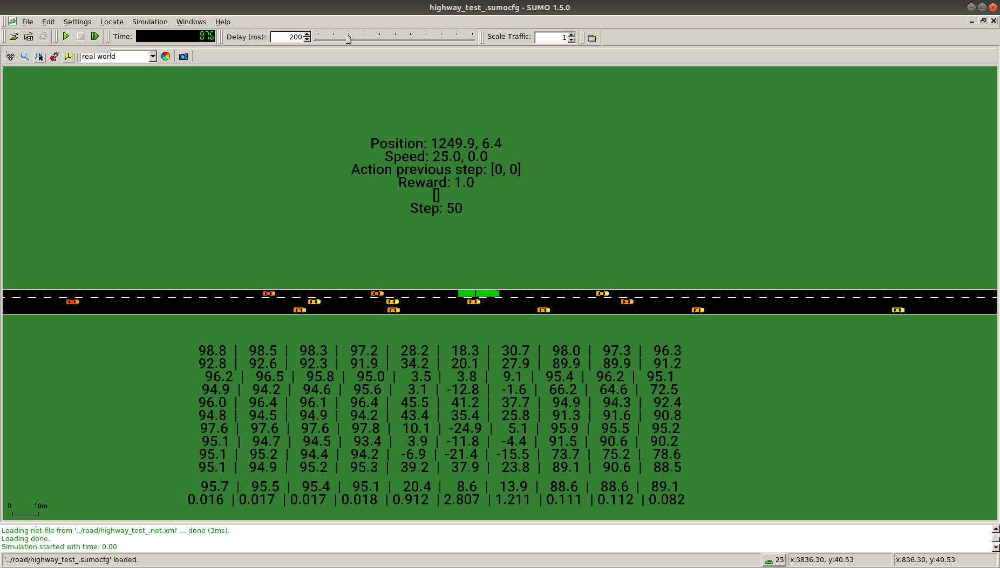

# Tactical Decision-Making in Autonomous Driving by Reinforcement Learning with Uncertainty Estimation

This repo contains the code that was used in the paper [Tactical Decision-Making in Autonomous Driving by Reinforcement Learning with Uncertainty Estimation](https://arxiv.org/abs/2004.10439).
If this code is used, please cite the paper and the repo.

Videos of the resulting agents are shown below.

---

## Videos

This section shows how the trained ensemble RPF and DQN agents perform in a few testing episodes within the training distribution, and in situations that are outside of the training distribution.


#### Test episodes within the training distribution

Ensemble RPF agent:


Displayed in x4 real time.


#### Situations outside of the training distribution


##### Standstill vehicle (white)

DQN agent:


Ensemble RPF agent:


Displayed in x1 real time.


##### Fast overtaking vehicle (purple)

DQN agent:


Ensemble RPF agent:


Displayed in x1 real time.


---

## Source code

#### Prerequisites

Python and Simulation of Urban Mobility ([SUMO](http://sumo.sourceforge.net/)).

Install and set SUMO environment variable:

```shell
$ apt-get update
$ apt-get install -y python3.7
$ apt-get install -y python3.7-dev
$ apt-get install -y python3-pip
$ apt-get install -y software-properties-common
$ add-apt-repository ppa:sumo/stable
$ apt-get update
$ apt-get install -y sumo=1.5.0+dfsg1-5 sumo-tools=1.5.0+dfsg1-5 sumo-doc
$ export SUMO_HOME="/usr/share/sumo"
```

Install dependencies:

```shell
$ pip3 install -r requirements.txt
```

#### Docker

Using Docker makes it even easier to get started. From the top folder, simply build with [Dockerfile](Dockerfile):


```shell
$ docker build -t <name> -f Dockerfile .
```

#### Usage

The code is relatively well documented. The following steps help to get you started.

##### Training process

To start the training of the agent, from [src/](src/), run:

```shell
$ python3 train_agent.py <log_name>
```

The performance of the agent is regularly tested on a set of test episodes. Logs are saved in logs/, where among other things the following are saved:
- Rewards and number of steps of the test episodes
- Weights of the neural networks for the test episodes
- A tensorboard log

The training process can be followed in tensorboard.


##### Parameters

The parameters of the agent are set in [parameters.py](src/parameters.py) and the parameters of the simulation environment are set in [parameters_simulation.py](src/parameters_simulation.py).


##### Observe trained agent

The performance of the trained agent can be observed in SUMO's GUI, both on the test episodes and on the special cases that are mentioned in the paper.

In [run_trained_agent.py](src/run_trained_agent.py), set *filepath* and *agent_name* to the agent you would like to test. Then, from [src/](src/), run:

```shell
$ python3 run_trained_agent.py
```

An example of the output is shown below.


The rows below the road show the estimated Q-values of the different ensemble members for all the actions, followed by the mean Q-values and the coefficient of variation for all the actions.


##### Tests

To make sure that the code is working and all dependencies are fulfilled, run the tests from [tests/](tests/) by

```shell
$ python3 -m unittest discover .
```


## License

This code is released under the MIT license, see [LICENSE.md](LICENSE.md) for details.


## Contact

Just send an email if you have any questions, carl-johan.hoel@chalmers.se.
