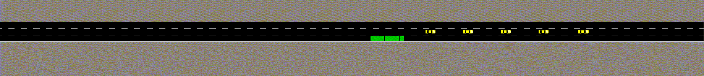
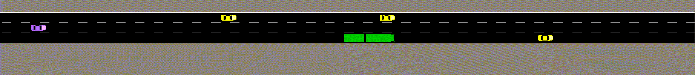

# Tactical Decision-Making in Autonomous Driving by Reinforcement Learning with Uncertainty Estimation

## Code

Once published, this repo will contain the code that was used in the paper "Tactical Decision-Making in Autonomous Driving by Reinforcement Learning with Uncertainty Estimation".

## Videos

This section shows how the trained ensemble RPF and DQN agents perform in a few testing episodes within the training distribution, and in situations that are outside of the training distribution.

### Test episodes within the training distribution

Ensemble RPF agent

Displayed in x4 real time

### Situations outside of the training distribution

#### Standstill vehicle (white)

DQN agent

Ensemble RPF agent

Displayed in x1 real time

#### Fast overtaking vehicle (purple)

DQN agent

Ensemble RPF agent

Displayed in x1 real time
